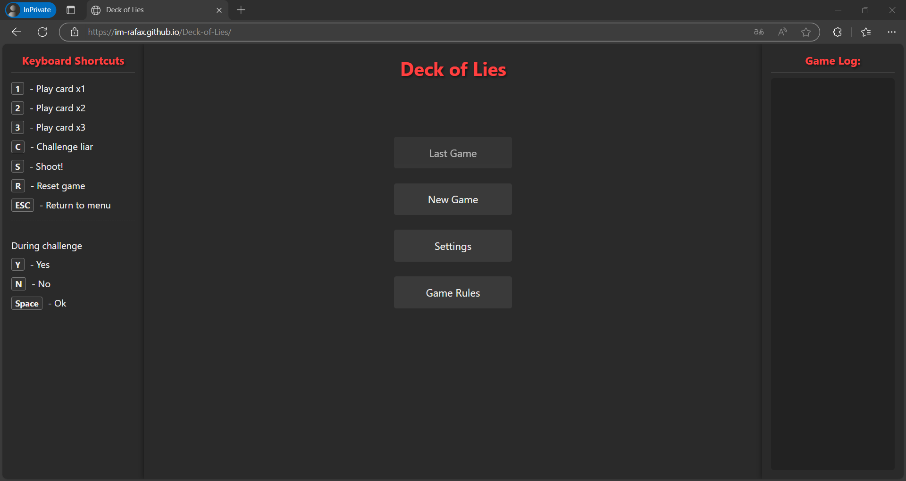
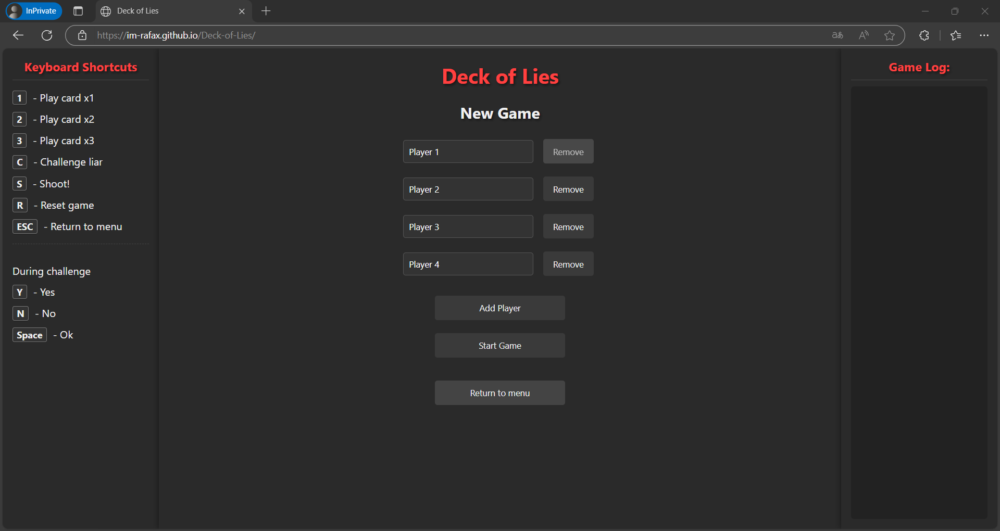
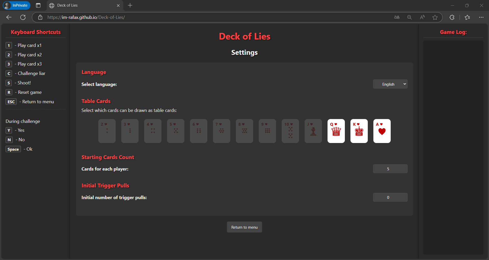
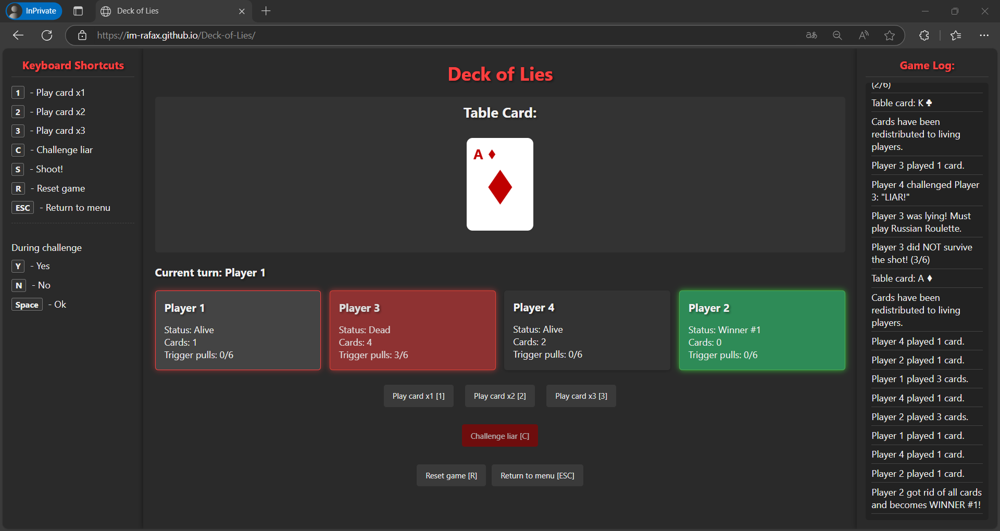
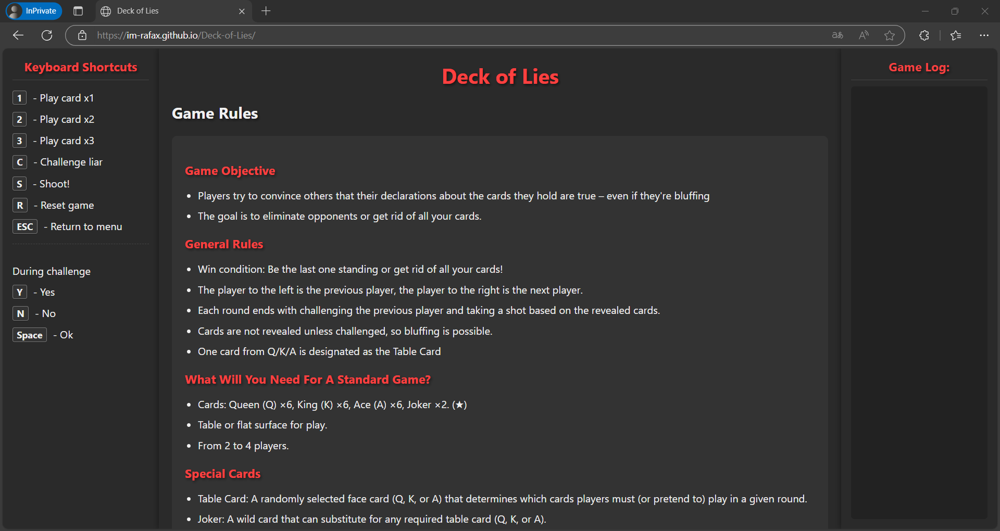

# Deck of Lies

## [Play Deck of Lies Online](https://rafal-p4wlowski.github.io/Deck-of-Lies/)

Deck of Lies is an interactive card game designed for live play. You can use the online version as a digital assistant for real-life gameplay. Play now!

[🇵🇱 Przeczytaj w języku polskim (README_PL.md)](README_PL.md)

## Project Description

Deck of Lies is an interactive card game that combines elements of bluffing and Russian roulette, primarily designed for live play with friends. This game is inspired by the mechanics of popular bluffing games, being an unofficial interpretation of concepts that combine tactical card play with an element of randomness.

## Features

- Game for 2-4 players, ideal for tabletop gameplay
- Two available languages: English (default) and Polish
- Intuitive interface with three columns (keyboard shortcuts, game area, logs)
- Simplified controls - one universal action button
- Control using mouse or keyboard shortcuts
- Game action logging system
- Animated cards and visual effects

## Game Interface

### Main Menu

### New Game

### Settings

### Game Screen

## Game Rules

### Game Objective

Players try to convince others that their declarations about the cards they hold are true – even if they're bluffing. The goal is to eliminate opponents through Russian Roulette or be declared a winner by the other players. The last remaining active player who hasn't won becomes the loser.

### Game Mechanics

1. Physical cards are in the players' hands. The app is only a digital assistant for gameplay.
2. On their turn, a player plays cards that should match the current table card (Q, K, or A).
3. The next player can either believe and add their cards or challenge the truthfulness of the previous player by saying "Liar!".
4. If a player's declaration turns out to be true – the challenger must pull the trigger of the revolver.
5. If bluffing is discovered – the player who lied must pull the trigger.
6. After each shot, a new table card is drawn.
7. Players can use the "Declare Winner" [W] button to select an active player and declare them a winner.
8. The game ends when only one active (alive and not declared a winner) player remains. This last player loses the game. The game also ends if all remaining players are declared winners.

## Control Keys

### Main Shortcuts
- **Space** - Perform action / Shoot / Accept
- **C** - Challenge liar
- **W** - Declare winner
- **R** - Reset game
- **ESC** - Return to menu

### During Challenge
- **Y** - Yes (was lying)
- **N** - No (was telling the truth)
- **Space** / **Enter** / **ESC** - Close result modal

## Mobile Keyboard Layout

Check out my custom keyboard layout for the Bluetooth Keyboard & Mouse app that makes playing easier.

[Custom Keyboard Layout](https://appground.io/layout/)
The link to the custom keyboard layout will be available soon.

### Download the App

To use the layout, download the [Bluetooth Keyboard & Mouse (Appground IO)](https://play.google.com/store/apps/details?id=io.appground.blek) app from the Google Play Store.

## How to Play Live?

1. **Prepare a physical deck of cards** - you need cards: Q, K, A, and Jokers.
2. **Open the game on a computer/tablet** - launch the game in a browser.
3. **Deal cards to players** - each player receives cards in hand.
4. **Use the app to draw a table card** - the app will randomly select a card (Q, K, or A).
5. **Play your turn** - when it's your turn, press the action button or space.
6. **Challenge a liar** - if you suspect bluffing, press C.
7. **Resolve the challenge** - manually check the player's cards and choose "Yes" or "No".
8. **Take a shot** - press space to check if the revolver fired.

## Author

rafal-p4wlowski

## License

This project is released under the MIT license.

---

© 2025 Deck of Lies
