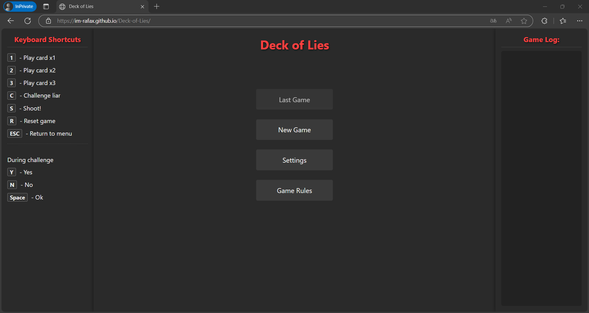
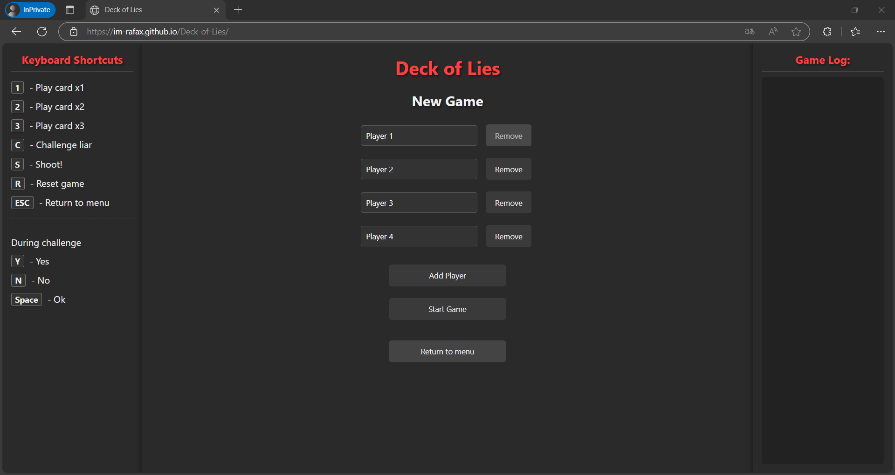
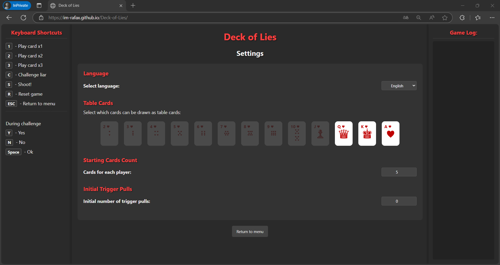

# Deck of Lies

## [Zagraj w Deck of Lies online](https://rafal-p4wlowski.github.io/Deck-of-Lies/)

Deck of Lies to interaktywna gra karciana zaprojektowana z myślą o rozgrywce na żywo. Możesz korzystać z wersji online jako cyfrowego wspomagacza do gry w realu. Zagraj teraz!

[eng Read in English (README.md)](README.md)

## Opis projektu

Deck of Lies to interaktywna gra karciana łącząca elementy blefowania i rosyjskiej ruletki, przeznaczona przede wszystkim do rozgrywki na żywo z przyjaciółmi. Ta gra jest inspirowana mechaniką popularnych gier blefowania, będąc nieoficjalną interpretacją koncepcji łączących taktyczne zagrania karciane z elementem losowości.

## Funkcje

- Gra dla 2-4 graczy, idealna do rozgrywki przy stole
- Dwa dostępne języki: angielski (domyślny) i polski
- Intuicyjny interfejs z trzema kolumnami (skróty klawiszowe, obszar gry, logi)
- Uproszczone sterowanie - jeden uniwersalny przycisk akcji
- Obsługa za pomocą myszy lub skrótów klawiaturowych
- System logowania akcji gry
- Animowane karty i efekty wizualne

## Interfejs gry

### Menu główne

### Nowa gra

### Ustawienia

### Ekran rozgrywki

## Zasady gry

### Cel gry

Gracze starają się przekonać innych, że ich deklaracje dotyczące posiadanych kart są prawdziwe – nawet jeśli blefują. Celem jest wyeliminowanie przeciwników.

### Mechanika gry

1. Karty fizyczne są w rękach graczy. Aplikacja jest tylko cyfrowym wspomagaczem rozgrywki.
2. W swojej turze gracz zagrywa karty, które powinny odpowiadać aktualnej karcie stołowej (Q, K lub A).
3. Kolejny gracz może uwierzyć i dołożyć swoje karty lub podważyć prawdomówność poprzedniego gracza, mówiąc "Kłamca!".
4. Jeśli deklaracja gracza okazuje się prawdziwa – osoba podważająca musi pociągnąć za spust rewolweru.
5. Jeśli odkryto blef – gracz, który kłamał, musi pociągnąć za spust.
6. Po każdym strzale losowana jest nowa karta stołowa.
7. Gra kończy się, gdy zostanie tylko jeden żywy gracz.

## Klawisze sterujące

### Główne skróty
- **Spacja** - Wykonaj akcję
- **C** - Wyzwij kłamcę
- **R** - Reset gry
- **ESC** - Powrót do menu

### Podczas wyzwania
- **Y** - Tak (kłamał)
- **N** - Nie (mówił prawdę)
- **Spacja** - Akceptuj

## Układ klawiatury do gry mobilnej

Sprawdź mój niestandardowy układ klawiatury dla aplikacji Bluetooth Keyboard & Mouse, który ułatwia grę.

[Niestandardowy układ klawiatury](https://appground.io/layout/)
Wkrótce się pojawi link do niestandardowego układu klawiatury.

### Pobierz aplikację

Aby korzystać z układu, pobierz aplikację [Bluetooth Keyboard & Mouse (Appground IO)](https://play.google.com/store/apps/details?id=io.appground.blek) ze sklepu Google Play.

## Jak grać na żywo?

1. **Przygotuj fizyczną talię kart** - potrzebujesz kart: Q, K, A, oraz Jokerów.
2. **Otwórz grę na komputerze/tablecie** - uruchom grę w przeglądarce.
3. **Rozdaj karty graczom** - każdy gracz otrzymuje karty do ręki.
4. **Użyj aplikacji do losowania karty stołowej** - aplikacja wylosuje kartę (Q, K lub A).
5. **Zagraj turę** - gdy jest twoja kolej, naciśnij przycisk akcji lub spację.
6. **Wyzwij kłamcę** - jeśli podejrzewasz blef, naciśnij C.
7. **Rozwiąż wyzwanie** - ręcznie sprawdźcie karty gracza i wybierzcie "Tak" lub "Nie".
8. **Wykonaj strzał** - naciśnij spację, by sprawdzić, czy rewolwer wystrzelił.

## Autor

rafal-p4wlowski

## Licencja

Ten projekt jest udostępniony na licencji MIT.

---

© 2025 Deck of Lies